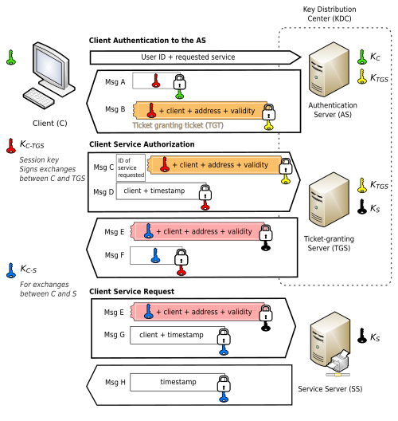

VNU - University of Science\
Class 21MMT - Encryption and Application 

# *Understanding User Authentication and look into Kerberos*

## Summary

In this project, we will dive into understanding how user authentication works, its development history and how it impacts the Internet. We would also implement a demonstration of Kerberos as an example of how the system works and looks like on the inside.

## Repository

This GitHub repository includes the following main folders

- /doc: Documentation of the project, including the original project proposal (/doc/proposal.docx) and finalized report document (/doc/report.pdf) conducting the research.

- /src: Implementation of Kerberos separated into 3 sections and a full code base with executables of the final version.

- /submissions: Records of progression checking during the course.

- /demo.webm: Recording of our demonstration of Kerberos.

## Code

We demonstrated a case of client authentication to a service server (SS) by Kerberos negotiations protocol.

Our Kerberos implementation consists of 3 steps which we divided into according folders and source codes as follows:

1. Client Authentication to the Authentication Server (/src/Client-KDC-part1).

2. Client Service Authorization to the Ticket-granting Server (/src/Client-KDC-part2).

3. Client Service Request to the Service Server (/src/Client-Service).

Since the main purpose of our work is about the authentication system, we used a simple Vigenère cipher for our encryption and decryption (src/Full/EncryptionUtils.h). 

For request contents and keys, we encapsulate within simple classes with no hierarchical architecture. Converting those to a message is simply done by concatenating class variables in the string form, before encryption.

# Authors

| Student ID | Name             |
| ---------- | ---------------- |
| 21127170   | Nguyễn Thế Thiện |
| 21127679   | Ngô Quốc Quý     |
| 19127628   | Nguyễn Mậu Việt  |
